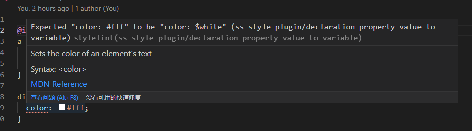
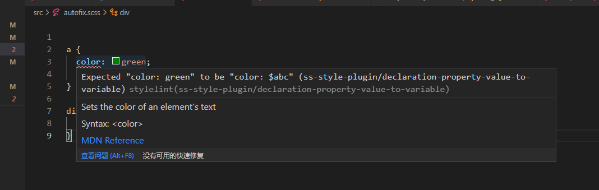
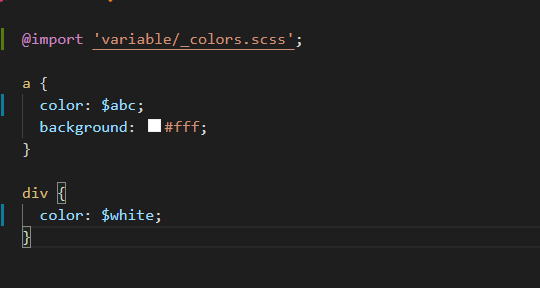

我们关心代码质量和用户体验。出于这个原因，我们使用各种工具来使开发更容易、更准确。其中，我们使用[Stylelint](https://stylelint.io/)来[整理](https://stylelint.io/)我们的 SCSS 和 CSS 文件。stylelint 的强大功能之一是能够添加您自己的规则，这将满足您的项目需求。虽然 stylelint 提供了用于添加自定义规则的 API，但第一次这样做时可能会有些混乱。


下面我们将完成向您的项目添加新的自定义 stylelint 规则的步骤：


1. 声明和创建插件
1. 向插件添加规则
1. 实现 linting 功能以及自动修复支持
1. 将插件与项目的 Stylelint 配置集成


# 背景故事


在我们应用程序的代码库中，我们将常用的颜色存储在变量中。这使得颜色主题更改非常快速和容易。在开发可视化组件时，我们使用 Invision 的模型作为参考。Invision 不知道我们使用的颜色变量。因此，从 Invision 复制样式涉及搜索颜色的变量（例如替换`#ff6363`为`$color-red`）。


这似乎很容易做到：使用“查找任何地方”并寻找这种颜色。然而，这个过程变得繁琐——尤其是当我们包含多种颜色时。此外，在某些遗留代码的情况下，`$color-red`未使用变量。因此，我们可以找到`#ff6363`分散在代码库中的相同颜色。在这种情况下，开发人员必须在所有搜索结果中找到正确的声明。


为了解决这个不便，我们编写了自定义的stylelint规则。它建议正确的变量名称，甚至自动修复错误。多么方便！





我们的自定义规则在起作用


在以下段落中，我们将描述添加您自己的自定义规则的步骤。作为一个简短的例子，我们将编写一个规则，讲属性值转换成变量。


# 编写插件


让我们从创建一个包含规则本身的文件开始——在我们的例子中，它是`declaration-property-value-to-variable.js`.
```javascript
const stylelint = require('stylelint');
const { ruleMessages, validateOptions } = stylelint.utils;
 
const ruleName = 'ss-style-plugin/declaration-property-value-to-variable';
const messages = ruleMessages(ruleName, {
   //… linting messages can be specified here
});
```
接下来，您需要定义规则。这样，当规则出现在配置中时，stylelint 将知道要运行什么：
您的文件将需要导出三项内容：

1. 规则名称
1. 显示的消息
1. 规则本身
```javascript
module.exports.ruleName = ruleName;
module.exports.messages = messages;
module.exports = stylelint.createPlugin(ruleName, function ruleFunction(primaryOption, secondaryOptionObject, context) {
   return function lint(postcssRoot, postcssResult) {
   // ... 
}});
```
如果它对你来说仍然没有多大意义，那没关系！在接下来的部分中，我们将解释每个部分。


# 创建插件


我们`stylelint.createPlugin`用来创建和注册一个 stylelint 规则。它接收两个参数：规则名称和 ruleFunction 本身。如果在lint过程中使用了这个规则，则 stylelint 调用 ruleFunction。函数接收配置的选项以及上下文对象。Lint 函数(ruleFunction 返回的函数)将在正在被连接的每个文件上运行。这是规则的实际核心，它将报告 linting 过程的输出。让我们深入研究一下规则函数和 lint


# 向插件添加规则


如前所述，stylelint 为每个单个 linting “进程”调用 ruleFunction。Stylelint 的规则支持[选项](https://github.com/testimio/testimio/pull/280)。这些可用于从 stylelint 的配置中自定义规则的行为。例如使用您的规则时，`ruleFunction`将使用匹配的选项（主要和次要）调用。
此外，stylelint 还提供了一个方便的 validateOptions 函数。如果用户传递的选项无效，则使用它自动报告错误。Stylelint 将把错误添加到链接结果(在这里称为 postcssResult)。文档并不是很广泛，但是源代码有一些很好的注释。ruleFunction 的第三个参数是上下文对象。它主要用于支持自动修复(稍后将详细介绍)


以下代码段应该使事情更清楚：
```javascript
module.exports = stylelint.createPlugin(ruleName, function getPlugin(primaryOption, secondaryOptionObject, context) {
   return function lint(postcssRoot, postcssResult) {
       const validOptions = validateOptions(
           postcssResult,
           ruleName,
           {
               //Options schema goes here
           }
       );
 
       if (!validOptions) { //If the options are invalid, don't lint
           return;
       }
       const shouldDoExtraCoolStuff = secondaryOptionObject.doStuff; //Parse the options to customize behaviour
       const isAutoFixing = Boolean(context.fix); //context.fix will be "true" if auto-fix mode is active
       //...
    }
}
```
我们已经完成了规则的设置。现在，让我们编写`lint`保存规则核心逻辑的函数。


# 执行 Linting


创建规则后，stylelint 将在每个 linted 文件上运行 PostCSS。接下来，在 linting 阶段，stylelint 将调用自定义规则的`lint`函数。该`lint`功能是您规则的核心。它接收两个参数：


- `postcssRoot`— 解析后的 AST。它[“代表一个 CSS 文件并包含其所有解析的节点”](https://api.postcss.org/Root.html)。
- `postcssResult`— [LazyResult](https://api.postcss.org/LazyResult.html)将累积您的规则[linting](https://api.postcss.org/LazyResult.html)的输出。


通常，该`lint`函数将：


1. “遍历” AST（解析的 CSS 节点）。使用其中一种`root.walk`[方法](https://api.postcss.org/Root.html#walk)完成此任务。
1. 检测无效节点。
1. 报告这些节点（或修复它们，取决于“修复”标志）。


让我们来看看我们规则的完整例子。建议颜色值替换成正确的变量名称，并且支持自动引入变量文件
```javascript


const stylelint = require('stylelint');

const { report, ruleMessages, validateOptions } = stylelint.utils;
const ruleName = 'ss-style-plugin/declaration-property-value-to-variable';
const messages = ruleMessages(ruleName, {
    expected: (unfixed, fixed) => `Expected "${unfixed}" to be "${fixed}"`,
});


function insertNode({postcssRoot, keyword, file}) {
    const hasProperty = postcssRoot.nodes.find(
        ({ type, name, params }) => type === "atrule" && name === "import" && params.includes(keyword)
    );
    // 有node的时候自动加上import
    if (!hasProperty && postcssRoot.first) {
        postcssRoot.insertBefore(postcssRoot.first, file)
    }
}

module.exports = stylelint.createPlugin(ruleName, function getPlugin(primaryOption, secondaryOptionObject, context) {
    return function lint(postcssRoot, postcssResult) {
        const validOptions = validateOptions(
            postcssResult,
            ruleName,
            {
                actual: primaryOption, // 验证主选项
                possible: (option) => {
                    if (typeof option !== 'object') {
                        return false
                    }
                    const primaryOptionKeys = Object.keys(option)
                    return primaryOptionKeys.length && primaryOptionKeys.every(k => {
                        return typeof option[k] === 'object'
                    });
                }, // 默认通过认证
            },
            {
                actual: secondaryOptionObject, // 验证第二选项
                possible: (option) => {
                    if (typeof option !== 'object') {
                        return false
                    }
                    return option.import;
                }, 
            }
        );

        if (!validOptions) { //如果选项无效，不是校验
            return;
        }
        // --fix选项
        const isAutoFixing = Boolean(context.fix) && !secondaryOptionObject.disableFix;
        let insertNodeFlag = false
        const keys = Object.keys(primaryOption)

        // 不去格式化非sass的文件
        if (postcssRoot.source.lang !== 'scss') {
            return
        }


        postcssRoot.walkDecls(decl => { 
            const hasProps = keys.includes(decl.prop) && Object.keys(primaryOption[decl.prop]).includes(decl.value);
            if (!hasProps) {
                return; //找不到替换的node - continue
            }
            const targetVal = primaryOption[decl.prop][decl.value]
            if (isAutoFixing) { // 修复模式下
                const newValue = decl.value.replace(decl.value, targetVal);
                insertNodeFlag = true
                if (decl.raws.value) {
                    decl.raws.value.raw = newValue;
                } else {
                    decl.value = newValue;
                }
            } else { // 不修复去报告
                report({
                    ruleName,
                    result: postcssResult,
                    message: messages.expected(`${decl.prop}: ${decl.value}`, `${decl.prop}: ${targetVal}`), // 生成报告的消息
                    node: decl, // 指定报告的节点
                    word: decl.value, // 哪个词导致了错误？这将正确定位错误
                });
            }
        });

        // 自动修复的时候插入css
        if (insertNodeFlag && secondaryOptionObject.import && secondaryOptionObject.import.length) {
            secondaryOptionObject.import.forEach(({keyword, file}) => insertNode({postcssRoot, keyword, file}))
        }
    };
});

module.exports.ruleName = ruleName;
module.exports.messages = messages;
```


# 自定义规则集成


编辑项目的[stylelint 配置](https://stylelint.io/user-guide/configure)（例如`.stylelintrc.json`）。在[“plugins”配置值下](https://stylelint.io/user-guide/configure#plugins)，添加插件文件的路径。剩下的就是激活您的规则，因此 stylelint 将实际运行它。通过将您的规则添加到[“规则”配置值来实现](https://stylelint.io/user-guide/configure#rules)。
一个最小的`.stylelintrc`文件看起来像这样：
```json
{
  "plugins": [
      "./plugins/declaration-property-value-to-variable.js"
  ],
  "rules": {
    "ss-style-plugin/declaration-property-value-to-variable": [{ 
      "color": {
        "green": "$abc",
        "#fff": "$white"
      }
    }, {
      "import": [
        {
          "keyword": "colors.scss",
          "file": "@import 'variable/_colors.scss';"
        }
      ]
    }]
  }
}
```
向`package.json`中加入`scripts`
```json
{
  "scripts": {
    "lint": "stylelint --fix \"**/*.{vue,less,postcss,css,scss}\" "
  }
}
```

运行`npm run lint`之后，自动导入变量文件，修复变量值

Stylelint 是一个非常有用的 linting 工具。在协作处理常见的 SCSS 和 CSS 文件时，它具有许多优势。它带有各种各样的现有规则。然而，它们不能总是满足您的所有需求。在某些时候，您将需要一个尚不存在的 linting 规则。它可能是项目的结构、您团队的约定或其他任何东西。在这些情况下，自定义规则将非常有用。
希望在阅读这篇文章后，您将能够快速创建和集成自己的 stylelint 规则。这样，您将在尊重项目要求的同时保持更高水平的代码质量。
​

如果你觉得文章不错，点个赞给个start，[github地址](https://github.com/mongofeng/stylelint-plugin)


# 参考文档


- [Stylelint 的插件文档](https://stylelint.io/developer-guide/plugins)
- [Awesome Stylelint — 很棒的 stylelint 配置、插件等列表](https://github.com/stylelint/awesome-stylelint)
- [Stylelint 的创建健壮规则的指南](https://stylelint.io/developer-guide/rules#commonly-overlooked-edge-cases)
- [PostCSS AST API](http://api.postcss.org/Root.html)
- [Custom Stylelint Rules — Writing Your First one](https://medium.com/swlh/writing-your-first-custom-stylelint-rule-a9620bb2fb73)


